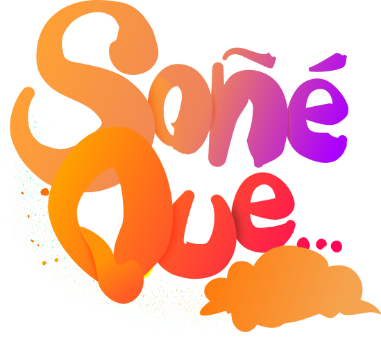

# ☁️ Soñe Que... ☁️

  </img>

<h3>🤗 Bienvenido al proyecto de la Red Social de Sueños y Pesadillas. Este es un trabajo colaborativo que tiene como objetivo brindar
  a los usuarios una plataforma donde puedan compartir y explorar sus experiencias oníricas, así como interactuar con otras personas 
  de manera significativa. 🤗</h3>
  
# Características principales

Publicación de Historias: Los usuarios pueden compartir sus sueños y pesadillas en forma de historias, acompañadas de imágenes que ilustren sus narrativas.

Interacción Social: Los usuarios pueden comentar en las publicaciones de otros usuarios y expresar su aprecio dando "me gusta" a los posteos que encuentren interesantes.

Autenticación segura: Implementamos un sistema de autenticación seguro utilizando JWT (JSON Web Tokens) para garantizar la seguridad de las cuentas de usuario.

Verificación de Email: Para proteger la integridad de la plataforma, requerimos que los usuarios verifiquen sus correos electrónicos mediante un proceso de confirmación por correo electrónico.

Almacenamiento en AWS: Las imágenes asociadas a las historias de los sueños y pesadillas son almacenadas de forma segura en un bucket de AWS (Amazon Web Services), 
  garantizando la disponibilidad y confiabilidad de los datos.

  
# Tecnologías utilizadas

Java y Spring Boot: Utilizamos el framework Spring Boot en conjunto con Java para desarrollar el backend de la aplicación, aprovechando su potencia y facilidad de uso.

JWT (JSON Web Tokens): Implementamos JWT para manejar la autenticación de usuarios de manera segura y eficiente.

Amazon S3: Utilizamos Amazon S3 para el almacenamiento seguro y escalable de las imágenes asociadas a las historias de los sueños y pesadillas.

# :iphone:Redes:iphone:
- [LinkedIn](https://www.linkedin.com/in/mauricio-mores-b3898817b/)
- [Email](mauri.f.mores@gmail.com)
- WhatsApp: 351-6422970

 
 </img> 

